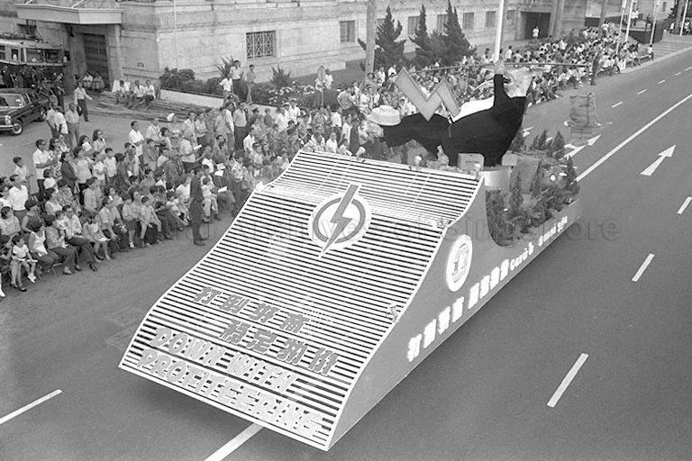
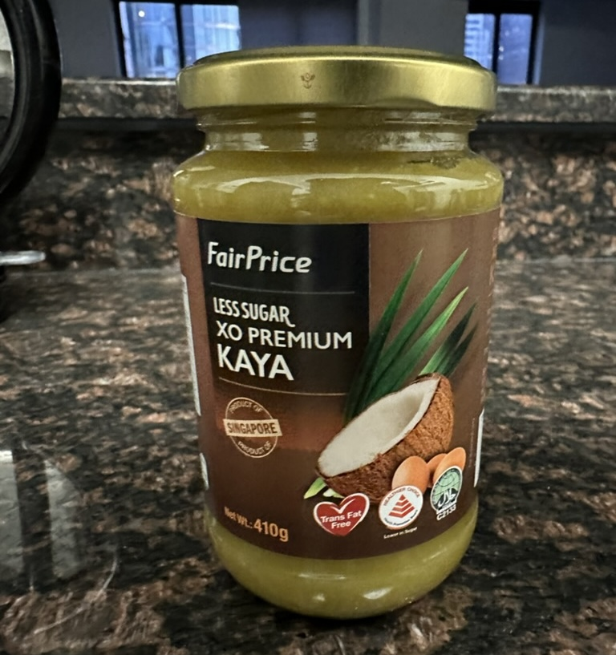

## Notes
 - I purchased this book after seeing it in a NTUC FairPrice store when I visited Singapore in 2023.
 - Many Singaporeans have told me that everyone refers to NTUC FairPrice simply as "NTUC". 
 - Events in the summary are presented as they were from the book, with no fact-checking.

## Summary
 - Chapter 1: NTUC Fairprice is created.
   - NTUC (National Trades Union Congress) was founded in 1961 and is the only labor union congress in Singapore. It is similar in purpose to AFL-CIO in the United States. 
   - In the 70s, Singapore experienced heavy inflation. The book never explicitly explains why, but the 1973 oil crisis likely played a part.
   - In response to high prices and profiteering during this time, the NTUC launches its first cooperative grocery store in Toa Payoh, called "NTUC Welcome".
   - [PAP Anti-profiteering float in 1973 parade](https://www.nas.gov.sg/archivesonline/photographs/record-details/dd468526-1161-11e3-83d5-0050568939ad). It reads "打倒奸商 稳定物价 DOWN WITH PROFITEERING" (ZH: ELIMINATE PROFITEERING, STABILIZE PRICES).  
   
   - PAP MP Phey Yew Kok launches two other cooperative grocery stores under SILO union and PIEU union. He is charged with misappropriation of funds and fleeds the country, leaving these two stores leaderless. 
   - SILO and PIEU merge in 1981 to form SEC.
   - SEC merges into NTUC Welcome in 1983 to form NTUC FairPrice.

 - Chapter 2: FairPrice Housebrand
   - The first product FairPrice sells under no brand is rice. 
   - NTUC formally launches its housebrand "FairPrice" in 1985.
   - Jar of FairPrice housebrand kaya that a friend bought for me:  
     
 
 - Chapter 3: Overseas Expansion
   - FairPrice attempts to expand into China, forming a joint venture "Nextmall" in 2003 with mainland partners.
   - The joint venture over-expands in China, leading to massive losses as they open unprofitable stores.
   - FairPrice fails to expand in Malaysia and Myanmar too. They find success in Hi Chi Minh City, Vietnam with four "Co.opXtra" hypermarts.
<!-- 
 - Chapter 4: 
   - Launches "Pasar", a brand for fresh foods. -->