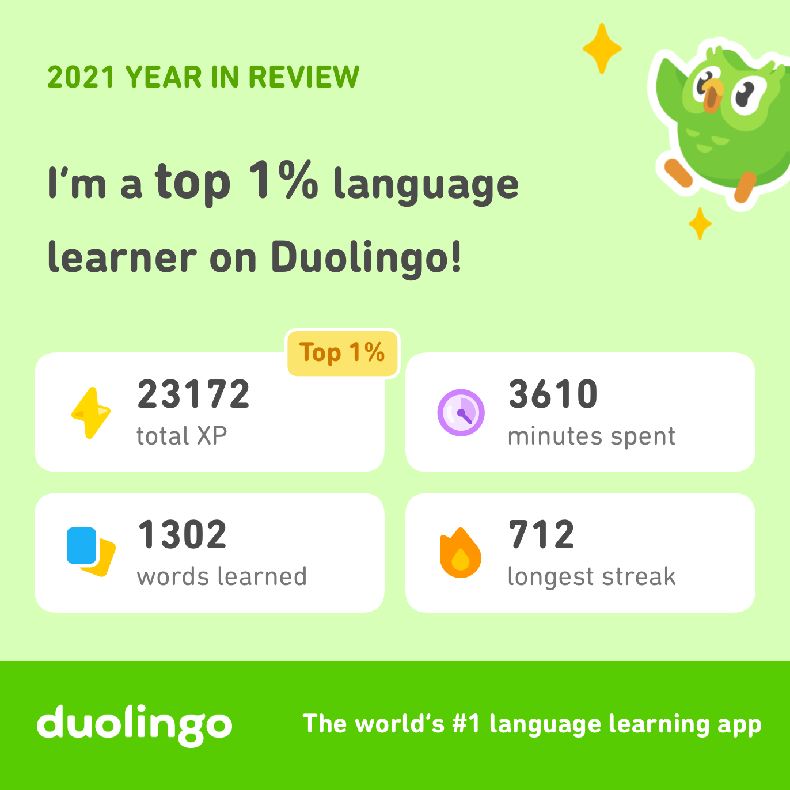

+++
title = "2022 New Year and New Website"
+++
## New Website

This blog post is the first on a new website powered by Hugo (past posts were imported). I spent way too long looking for an alternative to the abomination that is Jekyll along with its horrific Ruby version conflicts. Having found and settled on a better format for my online presence, I have some sort of desire to find and settle on better personal goals. If you sweep the corner of a room, might as well sweep it entirely, so to say. As we approach 2022, one might call these goals "New Year's Resolutions", but I'd like to avoid restricting self improvement as an annual event, even if only nominally.

## A Reflection on 2021 

The following are aspects of life I gave conscious thought to during 2021. I just said I was going to refrain from a yearly-themed self-help format, but this is just easier. Sue me.

### Human Languages
 - **Chinese:** For roughly 100 days, I routinely studied Chinese vocabulary using the "Daily Chinese" app. When I entered the fall semester of my Junior year, this habit quickly fell apart due to a seemingly unrelated event: my bathroom became too close to my bed.   
 Before returning to campus, I had developed the following routine at home: Immediately after waking up, I walked across the house to the bathroom to remove and wash my retainers. As I had already spent the effort getting up and going to the bathroom, I might as well brush my teeth, right? Here is where I squeeze in my Chinese flashcard practice. I hope you can see where this is going.
   
 In college, the bathroom is just three steps away from my bed. Every morning, I hear my alarm, take three steps into the bathroom, put away my retainers, then throw myself back into bed and fall asleep. I have just successfully nuked two habits at once: my Chinese flashcard practice and brushing my teeth in the morning.
 <!--   
 Within this experience, there is probably something to be said about how to consciously construct and maintain good habits. I recently found this idea is formalized as "piggybacking" by Wendy Wood in a recent _Hidden Brain_ Podcast ["Creatures of Habit"](https://hiddenbrain.org/podcast/creatures-of-habit/) 43:30, and I am sure the hundreds of other self-help literature explain a similar idea. It will probably be good to design  -->

 - **Japanese:** I kept up my daily Japanese lessons on Duolingo. Duolingo says I spent 3610 minutes in 2021 learning languages. I estimate 80% of that went to Japanese (rest Chinese), so we are looking at 48 hours of learning. The Duolingo streak is what keeps me going. It is not difficult to imagine how streaks motivate a daily habit, but they do require an "audience". For instance, in Snapchat, the streak's "audience" is the receiving party i.e. whoever is keeping the streak with you. This is the person who will notice that you broke a streak. For Duolingo, the concept of an "audience" doesn't really exist, at least not by default.
 
 To construct an audience in Duolingo, you must add friends who are completing language lessons on the app as well. The problem is finding similarly motivated friends, which becomes a sort of chicken and egg dilemma. Indeed, many of my friends expressed interest in using Duolingo but were wholly unmotivated to commit to a daily task. I eventually figured out a decent system to motivate these bumpkins. You can leverage the idea that people will assign somewhat greater importance to direct messages from real people. Thus, Fb-Duolingo was born: a way to incentivize people to commit to maintaining their Duolingo streak by sending them direct messages on Facebook Messenger when they were about to break a streak. The message explicitly states that they are about to break a "## days long" streak. A bit in the face, but you have to light the fire under their asses.

 - **English:** My vocabulary list is built up to roughly 90 words, starting at "abstruse" and ending at "vicissitude". There were no plans to actually study these words; I only gathered them. 

### Computer Languages
 - `C`: Not much happened here, except in compilers where I implemented a Cilk-like runtime for C0 and encountered errors I never knew were possible. We all know `SIGSEGV`, but have you seen `SIGBUS`? Somehow, I also got `SIGILL` when doing `-fPIE` stuff.
 - `C++`: I spent two weeks taking notes and trying examples from the website [learncpp.com](https://www.learncpp.com/). I made it from Chapter 1 to 17. Chapters 18+ appear to be mostly fancy C++11 stuff and move semantics aka trying to become Rust.
 - `Rust`: I did almost all 15451 programming assignments in Rust. Funnily, when I did the last assignment, I submitted it and on the first try, got 25/25 and 1st place on the code speed leaderboard. The bulk of my Rust improvement happened in Compilers where Konwoo and I struggled against the borrow checker with the help of Github Copilot (courtesy of Edward Li).
 - `Python`: Big year for Python. Pystreaming, warehouse-robots, IBM internship, and a few other side projects. 

### Habits
 - I stopped using my phone while in bed right after I got back on campus. It was like quitting cold turkey. I decided it was a horrible practice so I suddenly decided to stop.
 - I didn't really set any concrete goals to hit by the end of 2021, so there's not much else to say here. Being at home most of the year due to COVID lulled me back into being a lazy highschooler. Having my nagging parents around didn't help either. But I was able to bike a lot, so let's be grateful for that.

## Goals for 2022

### Human Languages
 - **Chinese:** If all goes well, I should be brushing my teeth in the morning again, so hopefully this habit will naturally regrow. To supplement the flashcard app, I have written and am planning to write translations for Chinese songs, newspaper articles, and other media.
 - **Japanese:** Keep Duolingo going strong. I got Duolingo Premium on a huge new year sale -- I use this app a lot, so why not pay for it and make it a more pleasant experience. I hope I can reach JLPT N4 level by the end of 2022.
 - **Korean:** Be able to quickly read Korean. I am not too interested in understanding Korean, I just want to be able to quickly read it. This is mostly so that I can actually sing the Korean songs that people queue up on karaoke machines. Also, this completes the CJK trio. In middle school, I had some weird goal of being able to read CJK. It looks like it will soon be realized.
 - **English:** Actually study the word list I made in 2021. Using Quizlet, this shouldn't be too hard.

### Computer Languages
 - `C`: Either I will need this a lot, or not at all, at my Nvidia internship. I hope its the former since I am sick of writing Python and I want to do some lower level performance-critical stuff.
 - `C++`: Try to learn this language's god forsaken inheritance and templating features.
 - `Rust`: Take Jack and Cooper's "Shilling the Rust Language" Stuco. Contribute to some open source projects. Create some cool web thing as Rust is good for web stuff it seems.
 - `Python`: Try out Cython and successfully create and link a Rust/C++/C extension to Python. This could be done by writing a simple C extension into pystreaming.

### Habits
 - Don't use your phone while trying to sleep. I did well in 2021, let's see how it goes in 2022. 
 - Actually go to lectures, or at least wake up before lectures begin. The 8:30am Compilers lecture is gone, so there is no excuse now.
 - No eating snacks, especially close to bedtime. Possibly enforce this by throwing away existing snacks then bankrupting myself so that I cannot buy more.
 - Hit the gym; it's literally downstairs.