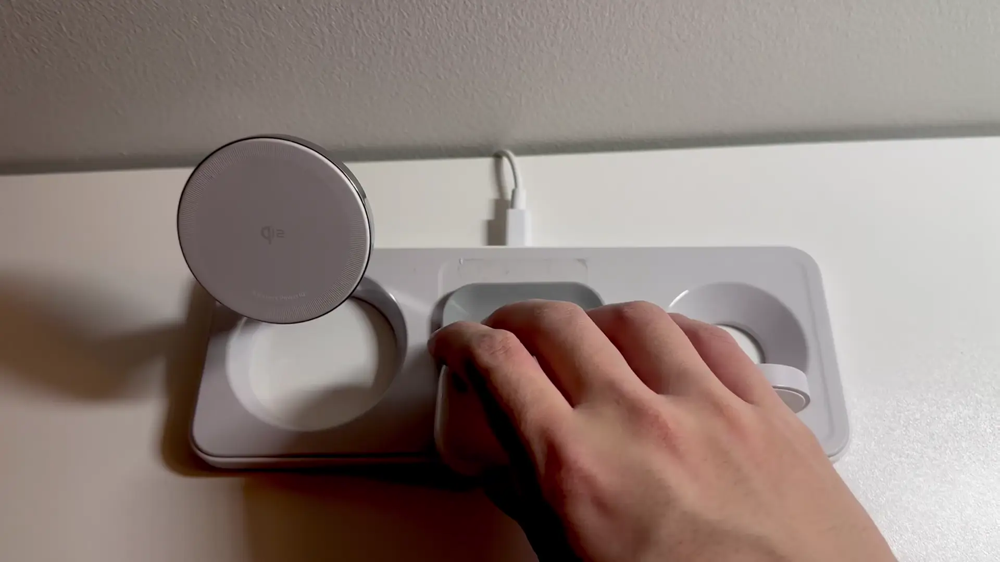

+++
title = "3d printed tray for wireless charger"
extra = {"featured_image" = "/personal_blog/magnet_charger_print/finished.jpeg"}
+++

## the problem 

I recently purchased an "Anker MagGo Wireless Charging Station (3-in-1 Pad)" to reduce the clutter on my desk at home and at work.

It is difficult to align my airpods with the center charger.  
 - If the airpods do not align, then they will not charge.  
 - If the airpods are slightly misaligned, then they will cycle between charging and not charging because the circuitry fails to establish a strong charging connection.
 - It is not visually pleasing to have misaligned airpods.

## the solution

📐 [CAD⇗](https://cad.onshape.com/documents/adafd8c0a8e7a8e844d16a05/w/d0c63042982a36d91585d415/e/6c5c6ab4ed946ac91684c114?renderMode=0&uiState=67ff16011409cc4afc0876d8)  
I made a tray so the airpods would slide into the correct place every time. 

